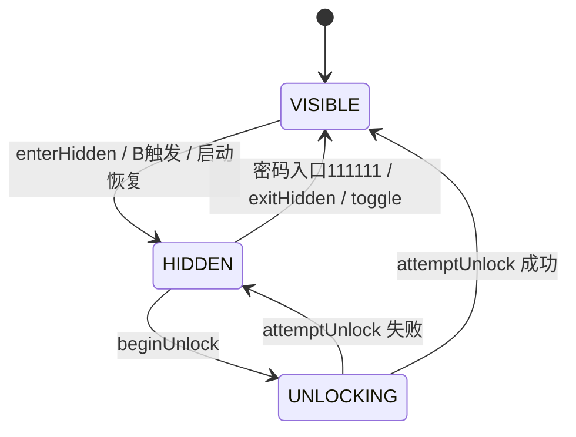

# 产品总闸 — 授权 / 状态机 / 功能开关 / 通知策略

> **权威口径**（2026-05-22 更新）。所有 P 任务、hook、AI 实现必须读本文件再写代码。  
> 关联：`StateMachine.java`、`Bridge.java`、`SearchUnlock.java`、`SearchFilter.java`、`native_core/API.md`

---

## 零、产品总闸四层模型

```
┌─────────────────────────────────────────────────────────┐
│  Layer 1  授权状态（LicenseBox）                         │
│           → 决定能不能用模块                              │
│                                                          │
│  Layer 2  功能开关（nativeCanUseFeature）                │
│           → 决定能用哪些功能（基础 vs 隐私）              │
│                                                          │
│  Layer 3  隐藏状态（StateMachine / nativeIsHidden）      │
│           → 决定密友/密群是否隐藏（id 过滤生效）           │
│                                                          │
│  Layer 4  通知策略（NotifyPolicy / SecretNotifyMode）    │
│           → 决定隐藏后如何提醒（静默/震动/特殊音）         │
└─────────────────────────────────────────────────────────┘
```

### 四层规则

1. **没有授权** → 所有功能不可用，完全透传微信
2. **有授权** → 基础功能可用（防撤回、虚拟定位、语音转发、改余额显示），不受隐藏状态影响
3. **有授权 + 隐私总开关打开 + 已添加密友/密群 + 当前 HIDDEN** → 密友/密群隐藏全面生效
4. **有授权但隐私总开关关闭** → 基础功能可用，密友/密群过滤不生效
5. **HIDDEN/VISIBLE 只影响 id 过滤类功能**，不影响防撤回/虚拟定位等基础工具功能

---

## 一、三句话

1. **状态机 = 密友隐藏的总闸**（显形 / 隐藏 / 解锁中）。
2. **VIP = 授权**（客户有没有资格用模块），**不是**「隐藏开关」。
3. **密码 = 入口手势**（主界面放大镜 → 全局搜索框），**不是**「输入监测用来藏人」，也不是授权码。

---

## 二、概念对照表（禁止混用）

| 产品用语 | 含义 | 代码（当前） | 备注 |
|----------|------|--------------|------|
| **状态机 · 隐藏态** | 正在藏密友/密群 | `State.HIDDEN` + `isActive()==true` | 总闸「开藏」 |
| **状态机 · 显形态** | 密友/密群正常可见 | `State.VISIBLE` + `isActive()==false` | 总闸「不藏」 |
| **VIP** | 已授权客户 | v1 占位 `LicenseGate`（待接 miyou-server） | **≠** `isActive` |
| **密友名单**（A2）| 要藏的个人 wxid 集合 | `Bridge.getWxids()` | 空名单不参与判定 |
| **密群名单**（A3）| 要藏的群 `*@chatroom` 集合 | `Bridge.getGroupIds()` | 空名单不参与判定 |
| **密码入口** | 全局搜索框输满密码 | `SearchUnlock` | 默认 `111111`；v1 可显形，禁止扩展成授权 |
| **B 模块触发** | 摇一摇 / Home / 切后台… | `TriggerGuard` | 推进状态机 → HIDDEN；B2 切后台为强隐私收纳 |

**禁止**：把 Catfish 遗留的 `isVipMode` 理解成「VIP 授权」。代码已改为 `isActive()` = 隐藏态是否生效。

---

## 三、总闸公式（所有藏人 hook 统一）

```text
shouldHide() =
    NativeBridge.nativeIsAuthorized()        // 授权（v1 占位 true，v2 接 LicenseBox）
    AND NativeBridge.nativeIsPrivacyEnabled() // 隐私总开关
    AND NativeBridge.nativeIsHidden()         // 状态机 = 隐藏态
    AND ( !Bridge.getWxids().isEmpty()
        OR !Bridge.getGroupIds().isEmpty() )  // 密友 OR 密群 任一非空即开闸
    AND !AppConfig.isKillSwitch()

// 单条 item 是否命中
shouldHideId(String id) =
    NativeBridge.nativeIsHiddenWxid(id)      // 个人 wxid
    OR NativeBridge.nativeIsHiddenGroup(id)  // 群（id 以 @chatroom 结尾）
```

不满足任一项 → **完全透传微信**，不删列表、不拦搜索。

> v1 过渡期：`NativeBridge` Phase 1–2 未就绪前，继续用 `Bridge.getWxids().contains()` Java 路径；Phase 3 装机验收后统一切换。

| 执行层 | 隐藏态下职责 | wxid | groupId |
|--------|----------------|:---:|:---:|
| `ContactFilter` | 通讯录（含"群聊"分组） | ✅ | ✅ |
| `ConvFilter` | 会话列表（个人 + 群聊条目同字段） | ✅ | ✅ |
| `MomentsFilter` | 朋友圈 D1/D2/D3（密群消息不出朋友圈，不涉及） | ✅ | — |
| `SearchFilter` | 全局搜索（FTS 结果 `z15.ef6` 等，持续补点） | ✅ | ✅ |
| **后期** | 通知栏状态（v1 不做） | ✅ | ✅ |

---

## 四、自动隐藏：何时开始藏

```text
隐藏装（LSPosed 模块已装且未 kill_switch）
  AND VIP 授权通过
  AND 状态机进入 HIDDEN（默认启动可恢复为隐藏；或由 B 模块触发进入）
  AND 密友名单非空
  → 自动隐藏「一切」*（见上表）
```

- **B 模块**（摇一摇、切后台、Home、锁屏…）：只负责在满足 VIP 时 **把状态机推到 HIDDEN**，不绕过总闸直接改列表。
- **B2 切后台/Home/手势离开微信/锁屏是强隐私收纳**：`VISIBLE` 时必须立即单向进入 `HIDDEN`，不是 toggle，不可关闭，不得因“短暂切后台/看通知/最近任务”跳过。
- **藏人**不依赖用户在搜索框输入什么关键词；老婆乱搜、乱输，只要仍是隐藏态 + 无正确密码，密友就 **搜不到、列表不见**。

---

## 五、密码入口（A4 / B6）

### UI 路径

```text
微信主界面 → 右上角放大镜 → 全局搜索（FTS）→ 顶部 EditText
```

不是聊天页输入框，不是通讯录内搜索。

### 行为

| 项 | 值 |
|----|-----|
| 默认密码 | `111111`（六个 1） |
| 触发 | `afterTextChanged` 全文 **精确等于** 密码，**不需回车、不需确认** |
| 响应状态 | **仅 `HIDDEN`** 时：密码正确 → `UNLOCKING` → `VISIBLE`（显形密友 + 入口重新可见），与授权无关 |
| 显形态 / 乱输 | **不改变状态机**（查岗安全） |
| 成功后 UI | 清空输入框 → 关闭搜索 Activity → 回主界面 |
| 改密 | `StateMachine.setPassword()`，持久化 `smpw` |

### 与藏人的关系

- 密码 **不** 触发藏人；藏人只看 `shouldHide()`。
- 密码是用户掌握的 **入口**，当前 v1 从隐藏态 **显形**；进隐藏靠 B 触发 / 启动恢复 / 其它产品入口（待统一）。
- 密码不是授权码，也不受授权拦截：只要默认口令 `111111` 正确，就可以显形并看到入口。
- 授权只决定能不能使用过滤、名单、通知策略等功能；不能阻止正确口令显形。
- 不得在 `SearchFilter` 中扩展口令逻辑。

实现：`moduleB/SearchUnlock.java`

---

## 六、全局搜索藏人（P20 / SearchFilter）

与密码 **两条线**：

| 线 | 机制 |
|----|------|
| **藏结果** | 隐藏态 + VIP + 名单 → 从 FTS 结果集合移除含密友 wxid 的项（如 `ArrayList.addAll` + `z15.ef6`） |
| **密码** | 见第五节 |

用户正常搜昵称/关键词时拦截 **结果**，不监测「输入内容是否像密码」。
全局搜索是聚合大过滤器，来源至少包括最近联系、联系人、群聊、聊天记录；不同来源的数据结构和渲染路径可能不同，禁止把单一路径写成全量结论。

实现：`moduleB/SearchFilter.java`（8.0.71 类名持续用 Frida 校准）

待补 P0：`hookSearchContact` 等价点（添加好友 / 联系人存在性 → 「未添加」）。

---

## 七、功能与状态对照表

| 功能 | HIDDEN 态 | VISIBLE 态 | 需要授权？ | 备注 |
|------|:---:|:---:|:---:|------|
| 好友列表过滤（ContactFilter）| ✅ 隐藏密友 + 密群 | ❌ 全部可见 | ✅ | 过滤生效条件：isActive() |
| 会话列表过滤（ConvFilter）| ✅ 隐藏密友 + 密群 | ❌ 全部可见 | ✅ | 群条目同字段，自动覆盖 |
| 朋友圈过滤（MomentsFilter）| ✅ 隐藏密友帖/点赞/评论 | ❌ 全部可见 | ✅ | D1/D2/D3（群不涉及） |
| 全局搜索拦截（SearchFilter）| ✅ 搜不到密友 + 密群 | ❌ 正常搜索 | ✅ | P20 待实现 |
| 通知伪装（C2）| ✅ **密友/密群消息通知显示为 weixin** | ❌ 正常通知 | ✅ | v2 起；HIDDEN 态必须伪装 |
| 防撤回（C1）| ✅ 有效 | ✅ 有效 | ✅ | **不受 HIDDEN/VISIBLE 影响** |
| 虚拟定位（E2）| ✅ 有效 | ✅ 有效 | ✅ | 同上 |
| 步数装b（E1）| ✅ 有效 | ✅ 有效 | ✅ | 同上 |
| 设置页密友入口 | ❌ 入口消失 | ✅ 入口可见 | ✅ | 注入到微信设置相关页面；HIDDEN 态必须不暴露入口 |
| B 触发监听（摇一摇等）| ❌ 摇一摇不监听 | ✅ 触发即隐藏 | ✅ | 见下节 |

> **核心规则**：「密友过滤」类功能看状态机；「附加功能」（防撤回/定位/步数）看授权，**不看状态**。

---

## 八、B 模块触发详解（参考 Catfish UserControll）

### 8.1 触发方向

- **B1-B5 全部单向 → HIDDEN**（紧急收纳，不是 toggle）
- **B6 单向 → VISIBLE**（密码解锁显形）
- 进入 HIDDEN 后，B1-B5 的监听器自动停止（省电 + 防误触）
- **B2 是强隐私收纳**：离开微信前台必须立刻 `VISIBLE → HIDDEN`，禁止改成可选项、延迟项或误触规避项。

### 8.2 实现参考（Catfish 验证模式）

```
enterHidden() 时：
  ① 摇一摇 ShakeHandler.stop()       — 不再监听加速度
  ② BroadcastReceiver 注销           — 省电
  ③ 震动反馈 VibratorHandler.vibrate() — 告知用户已隐藏
  ④ backToLauncher(false)             — 自动回主界面（可选）

enterVisible() 即 exitHidden() 时：
  ① 摇一摇 ShakeHandler.start()       — 开始监听（等待下次触发）
  ② BroadcastReceiver 注册两个 action：
     - android.intent.action.SCREEN_OFF          → 锁屏触发 enterHidden
     - android.intent.action.CLOSE_SYSTEM_DIALOGS → Home / 切 App / 手势导航触发 enterHidden
```

> **`CLOSE_SYSTEM_DIALOGS`** 覆盖了所有"离开当前 App"的场景：
> Home 键、Android 手势上划（iOS 风格）、Recent Apps 键、系统弹窗 dismiss。
> 不需要单独处理 B2/B3/B4，**一个广播全搞定**。

### 8.3 用户开关默认值

| 触发 | 默认 | 理由 |
|------|:---:|------|
| B1 摇一摇 | **关** | 误触率高；用户自行开启 |
| B2+B3 切后台/Home（CLOSE_SYSTEM_DIALOGS）| **开** | 防查岗最基础，不可关；触发后必须立即 HIDDEN |
| B4 返回键 | **关** | 误触，按页面判断复杂 |
| B5 锁屏（SCREEN_OFF）| **开** | 锁屏不见密友是基本需求 |
| B6 密码解锁 | **固定** | 不可关 |

---

## 九、状态机流转（简图）



---

## 十、查岗验收（产品）

| 场景 | 期望 |
|------|------|
| 隐藏态 + VIP + 有密友 | 列表/朋友圈/全局搜索均不见密友；搜不到与 TA 的聊天记录 |
| 隐藏态 + 乱输密码 | 无反应，仍隐藏 |
| 隐藏态 + 输满 `111111` | 自动回主界面，显形，密友可见 |
| 无 VIP | 模块不藏（v2 接授权后强制执行） |

---

## 十一、实现债务（文档→代码）

| 项 | 状态 |
|----|------|
| `LicenseGate` 统一门控 | ⬜ v1 占位 |
| 所有 Filter 首行 `shouldHide()` | 🟡 已用 `isActive()`，未接 VIP |
| **A3 密群 `Bridge.getGroupIds()`** | 🟡 数据层就位，Filter `shouldHideId()` 切换中 |
| `SearchFilter` + `hookSearchContact` | 🟡 部分 |
| B1–B5 触发进 HIDDEN | ⬜ |
| 通知栏状态 | ⬜ v2+ |

---

---

## 十二、通知策略（SecretNotifyMode）

### 12.1 配置项

| 配置键 | 类型 | 默认 | 含义 |
|--------|------|:----:|------|
| `notify_mode` | int | 0 | 0=SILENT / 1=VIBRATE / 2=SPECIAL_SOUND |
| `show_secret_unread_count` | bool | false | 解锁后/密友入口是否显示未读数 |

### 12.2 规则

- HIDDEN 态下，密友消息 / 密友来电 / 密友朋友圈互动 **默认全部静默**
- 静默 = 不响铃、不震动、不弹横幅、不暴露联系人、不暴露内容
- `show_secret_unread_count = true` 时：只能在**密友入口/解锁后**显示未读数，**不得污染微信原生 tab badge**
- 密友消息、密友来电、密友朋友圈互动 → 全部走 `SecretNotifyMode`
- `notify_mode = 2 SPECIAL_SOUND`：提示音**必须**与微信默认提示音不同

### 12.3 接口

```java
NativeBridge.nativeGetNotifyMode()              // 0/1/2
NativeBridge.nativeShouldShowSecretUnreadCount() // true/false
NativeBridge.nativeShouldBlockBadge(wxid)        // :push 进程用
NativeBridge.nativeShouldNotifySecret(wxid)      // 主进程通知判断
```

---

**变更记录**

| 日期 | 说明 |
|------|------|
| 2026-05-20 | 定稿：状态机总闸、VIP=授权、密码=入口、隐藏态藏一切 |
| 2026-05-20 | A3 密群（`*@chatroom`）提为 v1 一等概念，`shouldHide()` 公式加密群分支 |
| 2026-05-22 | 新增四层模型（授权/功能开关/隐藏状态/通知策略）；shouldHide() 接入 NativeBridge；新增通知策略 §十二 |
